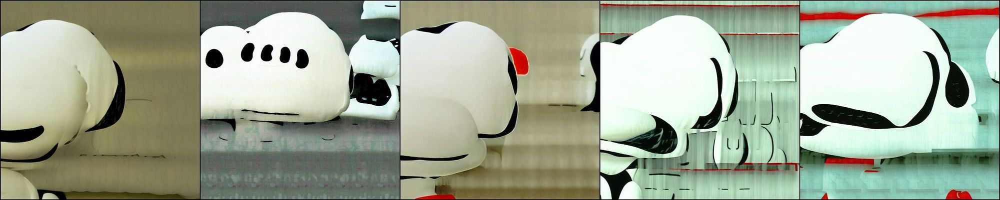

# PG_anonymous

## Pseudo-code

## Bad cases (Out of limitation)

|  |
|:--:|
| Enhancing the Snoopy concept 5 times(coefficient>1) results in corrupted images. |

|  | CLIP-Score | CLIP-Acc |
| --- | --- | --- |
| Snoopy | 0.745674 | 0.94 |
| enhance Snoopy | 0.801875 | 1 |
| enhance 5 Snoopy | 0.658799 | 1 |
| enhance 5 Snoopy(NTK) | 0.797998 | 1 |

## Redrawing of Figure 13

